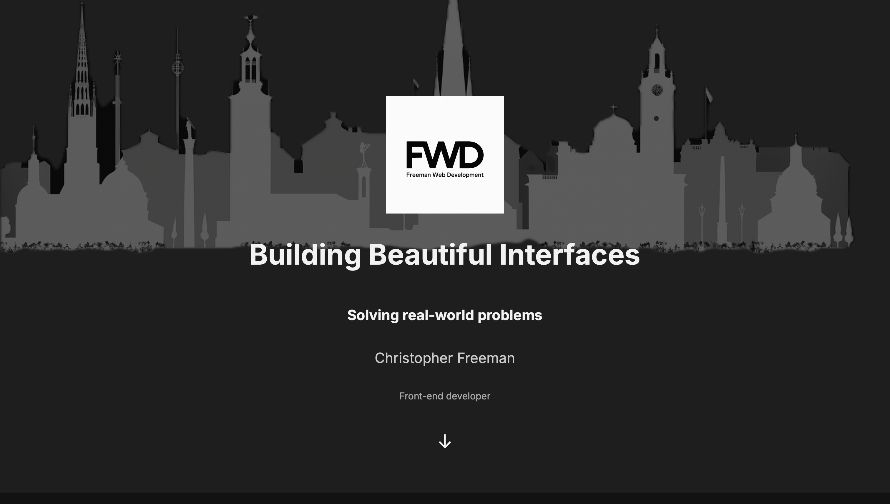
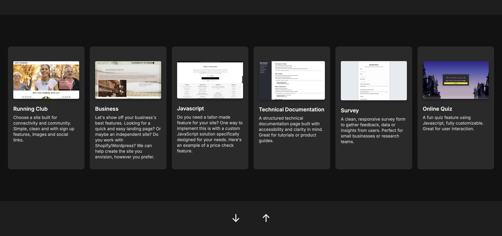

# 🧑‍💻 Christopher Freeman Portfolio

> A professional front-end web development portfolio showcasing responsive design, accessibility, interactive JavaScript functionality, and creative UI/UX projects.

---

## 🌐 Live Site  
[Visit Portfolio Website](https://cfree87.github.io/portfolio/)

---

## 🛠️ Built With  
- HTML5  
- CSS3  
- JavaScript  
- Git & GitHub  
- Responsive Web Design  

---

## 📸 Screenshots  
  
  

---

## 📄 Featured Projects  
- ✅ **Love Running** – Multi-page responsive website promoting a fictional running club  
- ✅ **Survey Form** – Semantic and accessible form for user feedback  
- ✅ **Technical Documentation Page** – Scrollable, navigable documentation UI  
- ✅ **Sustainable Fashion Landing Page** – Content-rich marketing layout  
- ✅ **Harry Potter Quiz** – Interactive JavaScript quiz app  

---

## 💡 Purpose  
This portfolio was created to serve as a living collection of my development work. It is continuously evolving as I build new projects and sharpen my front-end skills. Designed with a mobile-first approach and hosted on GitHub Pages.

---

## 🚀 How to Use  
1. Clone this repository:
   ```bash
   git clone https://github.com/csfree87/Portfolio.git
   ```

2. Open `index.html` in your browser  
   _or_  
   Use a local development server (like Live Server in VS Code)  

---

## ✍️ Author  
**Christopher Freeman**  
📧 [FWDbyChristopher@gmail.com](mailto:FWDbyChristopher@gmail.com)  
🔗 [LinkedIn Profile](https://www.linkedin.com/in/christopher-freeman-05497322a/)

---

## 📘 License  
This project is licensed under the MIT License - see the [LICENSE](LICENSE) file for details.
